<div align="center">

<picture>
  <source media="(prefers-color-scheme: dark)" srcset="docs/assets/logo-dark.png">
  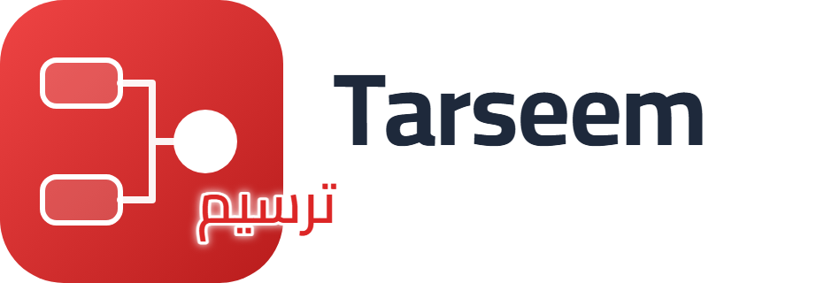
</picture>

### Schema-driven diagrams for Python — architecture-grade output from validated JSON, with first-class Arabic / RTL.

[](LICENSE)
[](https://www.python.org/)
[](https://github.com/A-H-911/tarseem/actions/workflows/ci.yml)
[](#-arabic--rtl-is-first-class)


</div>

---

**Tarseem** (Arabic: **ترسيم**, *"to chart / delineate"*) turns a validated JSON spec into a
publication-quality diagram. It is a thin, careful **orchestration over mature engines** —
[ELK](https://www.eclipse.org/elk/) for layout, a programmatic SVG renderer for the canonical
artifact, and Chromium for raster/PDF — never a from-scratch monolith. One positioned model
feeds **many writers**, so SVG, PNG, PDF, editable **draw.io**, and native **PowerPoint** all
come out of the *same* geometry.

<div align="center">
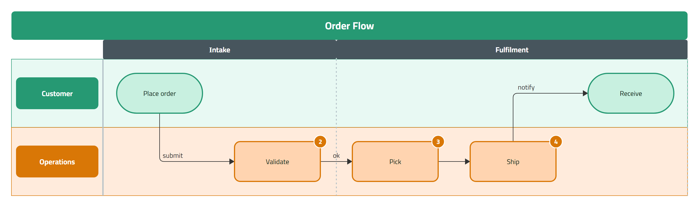
<br><sub><i>A swimlane with phase columns, per-lane tints, and auto-number badges — rendered by Tarseem from a ~30-line JSON spec.</i></sub>
</div>

## Why Tarseem

- 🌍 **Arabic / RTL is first-class, not bolted on.** Text is shaped with [HarfBuzz](https://harfbuzz.github.io/) (`uharfbuzz`) *before* layout; RTL is a geometry mirror (headers flip right, arrows reverse, badges mirror) while the theme stays invariant. No double-shaping, no CairoSVG.
- 📐 **One positioned IR, many writers.** `spec → validate → IR → measure → layout → positioned IR → writers`. No writer computes its own layout, so every format agrees pixel-for-pixel.
- ✍️ **Editable exports, not screenshots.** The `.drawio` and `.pptx` writers emit real shapes you can open and edit — with an honest **capability report** of anything a format can't carry (invariant: *never silent drops*).
- 🔁 **Deterministic by design.** Pinned elkjs + Chromium; the same spec produces byte-identical output, and every artifact embeds its spec hash + engine versions.
- 🧩 **Eleven diagram families.** Flowchart, architecture / C4, dependency, swimlane, sequence, ER, state, deployment, UML class, mindmap, and activity — all through one schema and one engine.
- 🤖 **Agent-ready.** A pure `generate(spec) → JSON` function that never raises on bad input (coded, path-precise errors to self-repair against), a published JSON-Schema bundle for LLM tool-use, and a ready-to-use [reference skill](integrations/claude-skill/SKILL.md).
- 🔌 **Extensible.** Diagram types are entry-point plugins (ADR-008); the eleven built-ins register through the *same* public mechanism third-party families use.

## How it works

<div align="center">
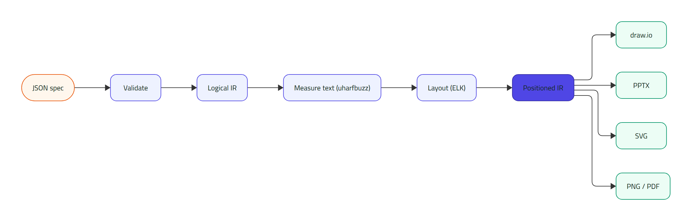
<br><sub><i>The architecture invariant — drawn by Tarseem itself (<code>docs/assets/readme/specs/pipeline.json</code>).</i></sub>
</div>

## Quick start

> **Tarseem v1.0.0** — schema frozen at v1.0 (Apache-2.0). Install from source (Python ≥ 3.10):

```bash
git clone https://github.com/A-H-911/tarseem.git
cd tarseem
python -m venv .venv && . .venv/bin/activate      # Windows: .venv\Scripts\activate
pip install -e ".[dev]"
playwright install chromium                        # for PNG / PDF / visual checks
tarseem doctor                                     # verify Node, elkjs, Chromium, fonts
```

Write a spec — `hello.json`:

```json
{
  "specVersion": "1.0",
  "diagramType": "flowchart",
  "direction": "TB",
  "meta": { "title": "Order processing" },
  "nodes": [
    { "id": "start",   "shape": "stadium",   "label": { "text": "Start" } },
    { "id": "instock", "shape": "diamond",   "label": { "text": "In stock?" } },
    { "id": "ship",    "shape": "roundrect", "label": { "text": "Ship order" } },
    { "id": "back",    "shape": "roundrect", "label": { "text": "Back-order" } }
  ],
  "edges": [
    { "id": "e1", "source": "start",   "target": "instock" },
    { "id": "e2", "source": "instock", "target": "ship", "label": { "text": "yes" } },
    { "id": "e3", "source": "instock", "target": "back", "label": { "text": "no" } }
  ]
}
```

Render it:

```bash
tarseem validate hello.json                        # coded errors, if any
tarseem render  hello.json -o hello.svg            # canonical SVG
tarseem export  hello.json -f png,pdf,drawio,pptx  # every other format
```

<div align="center">
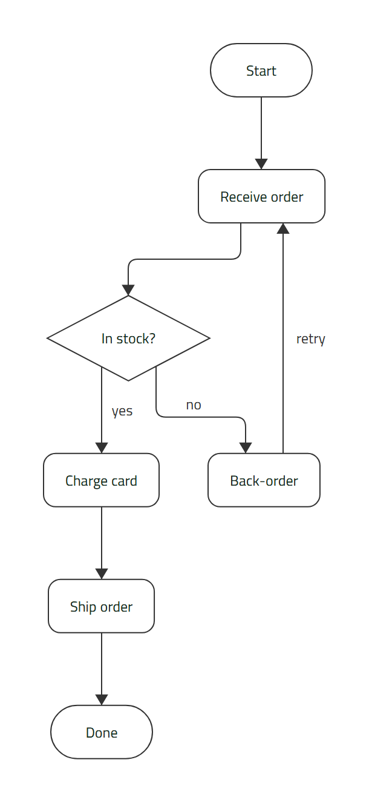
</div>

## Use it from an agent or LLM

Tarseem has a first-class **agent surface**: one pure function that renders a spec to JSON and
**never raises on a bad spec** — invalid input comes back as coded, path-precise errors an agent can
self-repair against. Full guide: **[`docs/guide/agents.md`](docs/guide/agents.md)**.

```python
from tarseem import generate, schema_bundle

out = generate(spec)                 # default: inline SVG, no files, no browser
if out["ok"]:
    svg, metrics = out["svg"], out["report"]
else:
    for e in out["errors"]:          # {code, path, message, hint} — path is a JSON Pointer
        print(e["code"], e["path"], "->", e["hint"])

tool_schema = schema_bundle()        # JSON-Schema (2020-12) for LLM tool-use / editor $schema
```

- **SVG by default, Chromium-free.** PNG/PDF/draw.io/PPTX need an `out_dir`; raster runs in a
  subprocess, so `generate` is safe to call from inside an async agent / MCP event loop.
- **CLI faces** for shell and agent harnesses:
  ```bash
  tarseem generate spec.json -f svg,png -o build/   # JSON {artifacts, report} on stdout (exit 1 if !ok)
  tarseem schema   -o tarseem.schema.json           # emit the JSON-Schema bundle
  tarseem migrate  old.json -o new.json             # upgrade a spec to schema v1.0
  ```
- **Reference skill** — **[`integrations/claude-skill/SKILL.md`](integrations/claude-skill/SKILL.md)**
  is ready to drop into an agent's skills directory: discover the schema, author a spec, `generate`,
  then self-repair against the error contract. New plugin families appear in `schema_bundle()`
  automatically — no change to the agent surface.

## Gallery

Every image below is produced by the engine from a spec in [`examples/`](examples/). Run `tarseem examples` to list them all.

<table>
<tr>
<td width="50%" align="center"><b>Flowchart</b><br></td>
<td width="50%" align="center"><b>Architecture / C4</b><br>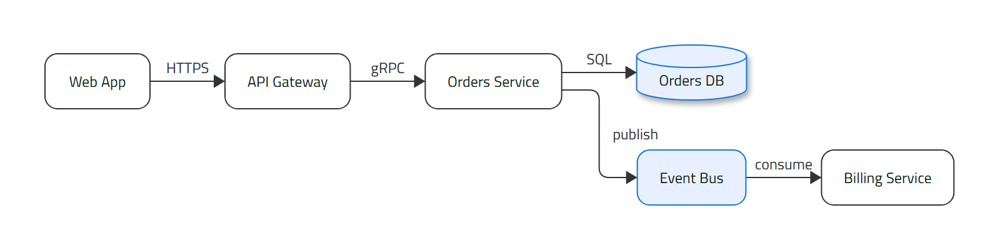</td>
</tr>
<tr>
<td width="50%" align="center"><b>Mindmap</b><br>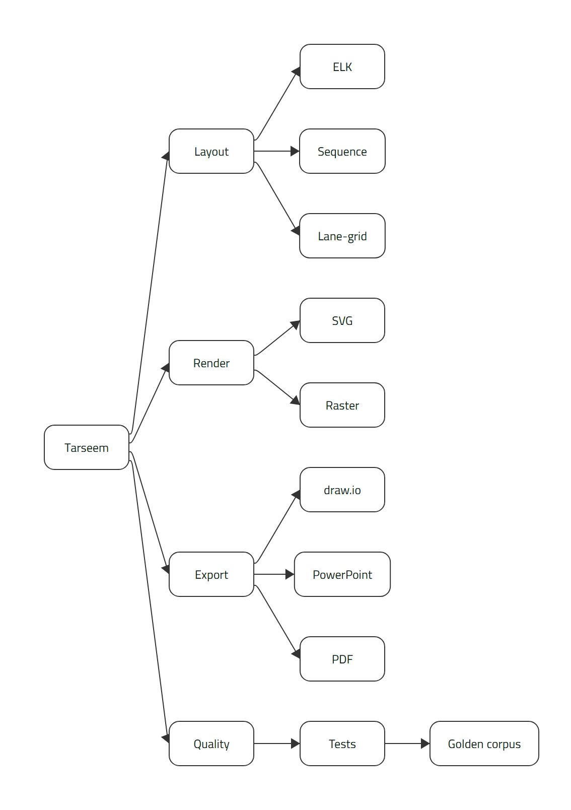</td>
<td width="50%" align="center"><b>UML class</b><br>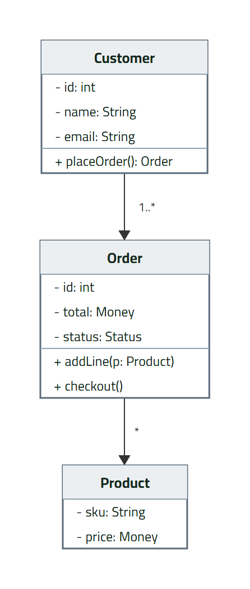</td>
</tr>
<tr>
<td width="50%" align="center"><b>Sequence</b><br>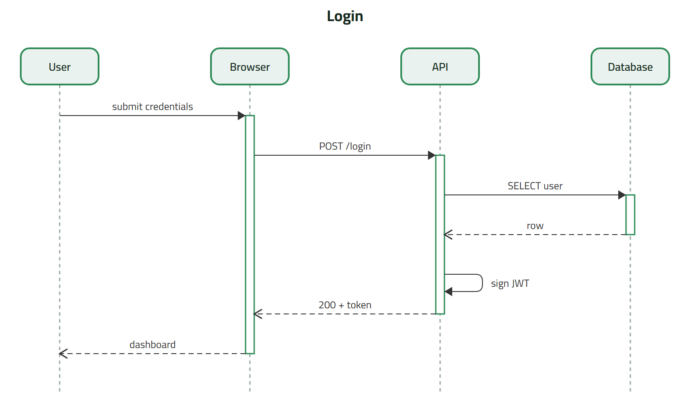</td>
<td width="50%" align="center"><b>Entity–relationship</b><br>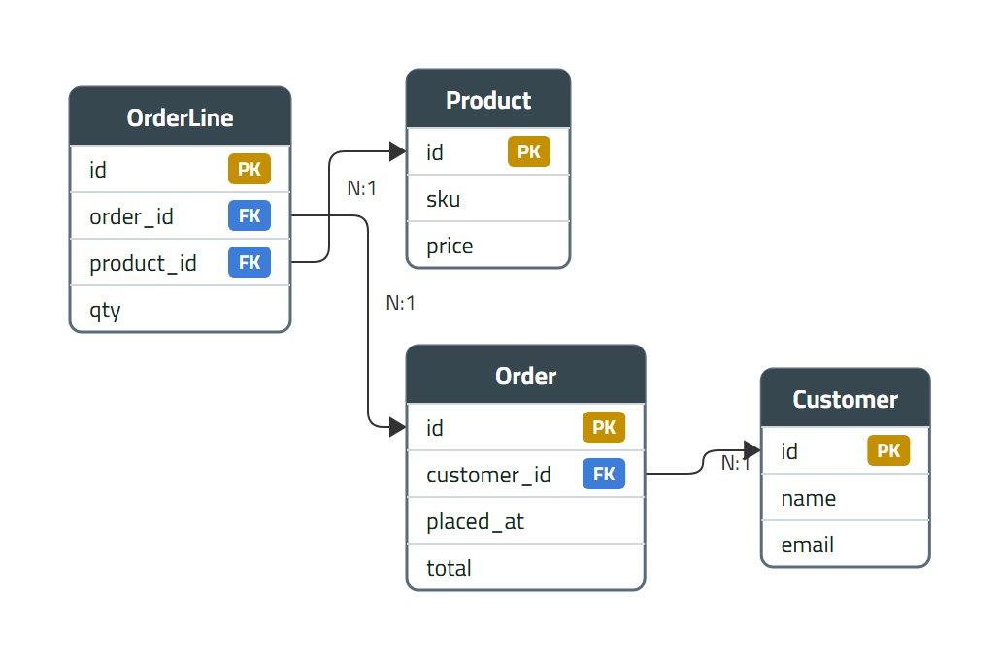</td>
</tr>
</table>

## 🌍 Arabic / RTL is first-class

RTL is treated as a **geometry mirror**, not a font swap: lane headers move to the right, flow
and arrows reverse, number badges flip corner — while the theme stays invariant. Text is shaped
with HarfBuzz *before* layout, so advances are correct and nothing is double-shaped.

<table>
<tr>
<td width="58%" align="center"><b>RTL swimlane</b><br>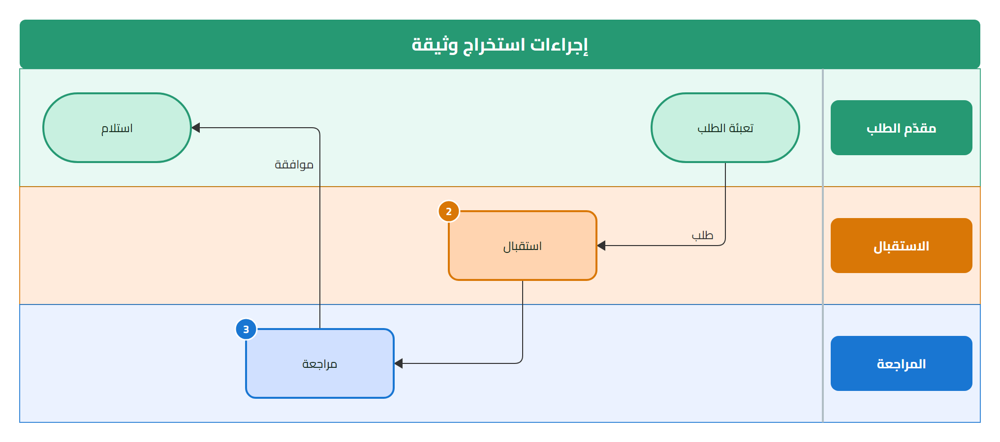</td>
<td width="42%" align="center"><b>Arabic flowchart</b><br>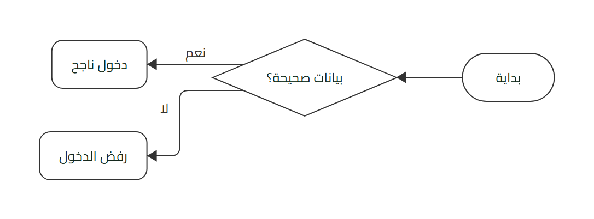</td>
</tr>
</table>

## Export formats

| Format | Role | Notes |
|---|---|---|
| **SVG** | Canonical artifact | Own programmatic renderer; subset WOFF2 fonts embedded by default |
| **PNG** | Raster | Faithful raster of the SVG via Chromium |
| **PDF** | Print / share | Chromium print-to-PDF (visual; searchable-Arabic text layer deferred) |
| **draw.io** | Editable | Explicit mxGraph cells matching the SVG (ADR-007), `writingDirection=rtl`, uncompressed |
| **PPTX** | Editable | Native python-pptx shapes & connectors from positioned IR; RTL paragraph patch |

Every writer returns a **capability report** declaring what it carried and what it dropped — unsupported features surface as machine-readable warnings, never silent omissions.

## CLI

```text
tarseem validate <spec>                 # validate; coded errors to stdout
tarseem render   <spec> -o out.svg      # render to canonical SVG
tarseem export   <spec> -f svg,png,pdf,drawio,pptx -o out/
tarseem generate <spec> -f svg,png -o out/   # agent surface: render -> JSON {artifacts, report}
tarseem schema   -o tarseem.schema.json # emit the JSON-Schema bundle (IDE / LLM tool-use)
tarseem migrate  <spec> -o new.json     # upgrade a spec to the current schema version (1.0)
tarseem doctor                          # verify Node / elkjs / Chromium / fonts
tarseem examples                        # list bundled example specs
tarseem gallery                         # build the static HTML gallery from examples/
```

## Architecture

Tarseem holds a small set of non-negotiable invariants (changing one requires an ADR):

1. **One positioned IR, many writers** — no writer computes its own layout.
2. **Layout = ELK** via a pinned, vendored elkjs bundle in a long-lived Node subprocess (sequence diagrams use a custom deterministic Python layouter).
3. **Rendering** = own SVG renderer (canonical); raster/PDF via Chromium only.
4. **Arabic / RTL first-class** — HarfBuzz measurement, geometry-only mirroring, bundled Cairo font.
5. **Editable exports are writers, not conversions.**
6. **Capability reports, never silent drops.**
7. **Determinism** — pinned engines; same spec ⇒ identical output.
8. **Diagram types are plugins** registered via entry points.

Full design lives in [`docs/plan/`](docs/plan/) (the approved contract) and [`docs/adr/`](docs/adr/) (decisions ADR-001…009).

## Documentation

| Guide | What |
|---|---|
| [Quick start](docs/guide/quickstart.md) | First spec → diagram |
| [Diagram families](docs/guide/families.md) | All 11 families and their spec shapes |
| [Arabic / RTL](docs/guide/rtl-arabic.md) | Shaping, geometry mirroring, fonts |
| [Exports](docs/guide/exports.md) · [PowerPoint](docs/guide/powerpoint.md) | Formats + editable-export fidelity |
| [Agent & tool integration](docs/guide/agents.md) | `generate`, the schema bundle, the reference skill |
| [Extending — clone a type](docs/extending/clone-a-type.md) | Add a diagram type as a plugin |
| [Limitations](docs/guide/limitations.md) · [Troubleshooting](docs/guide/troubleshooting.md) | Known ceilings + error-code catalog |
| [Architecture decisions](docs/adr/) | ADR-001…009 |

Want to contribute? See **[CONTRIBUTING.md](CONTRIBUTING.md)**.

## Project status

**v1.0.0 — released (schema frozen at v1.0).** Phases 0–7 complete; full acceptance F1–F12 met (see [`docs/phase-7-acceptance-audit.md`](docs/phase-7-acceptance-audit.md)).

| Phase | Scope | Status |
|---|---|---|
| 0 | Discovery & validation spikes | ✅ done |
| 1 | Requirements & architecture baseline | ✅ done |
| 2 | Minimal schema & core engine (MVP core) | ✅ done |
| 3 | Browser gallery & test harness — **MVP declared** | ✅ done |
| 4 | Styling, themes & Arabic / RTL | ✅ done |
| 5 | Advanced layout, routing & remaining families | ✅ done |
| 6 | Export & editability (draw.io, PPTX, PDF; class, mindmap) | ✅ done |
| 7 | Extensibility & agent readiness (entry-point plugins, agent surface, schema v1 freeze) | ✅ done |

> Deferred: Mermaid / PlantUML source writers, a searchable-Arabic PDF text layer, and the mkdocs-material site + auto-generated per-object schema reference (presentation/tooling, not engine capability).

## Development

- **Python ≥ 3.10.** Layout runs in a Node subprocess (vendored, pinned elkjs); raster/PDF via Playwright-managed Chromium.
- Test: `pytest` · Lint: `ruff check .` · Types: `mypy`
- Every feature lands with a golden sample in `examples/`, rendered into the gallery. No phase starts with red CI.

## License

[Apache-2.0](LICENSE).

The bundled **Cairo** font (used for the logo and as the default diagram font) is licensed under the [SIL Open Font License](src/tarseem/assets/fonts/OFL.txt).

---

<div align="center"><sub>Tarseem · ترسيم — one positioned model, many writers.</sub></div>
